#**Contents**#
1. Chapter 1- Introduction . . . .. . . . . . . . . . . . . .. . . . . . . . . . . .1

1.1 Description  . . . . . . . . . . . . . . . . . . . . . . . . . . . . . . . . . .1	

1.2 Variable and Data  . . . . . . . . . . . . . . . . . . . . . . . . . . . . . . .1	

2. Chapter 2- Stock selection Analysis . . . . . . .. . . . . . . . . . . . . . . .2	

2.1 Scope . . . . . . . . . . . . . . . . . . . . . . . . . . . . . . . . . . . . . . 2	

2.2 Methodology  . . . . . . . . . . . . . . . . . . . . . . . . . . . . . . . . . . 2	

	2.2.1 PE Ratio. . . . . . . . . . . . . . . . . . . . . . . . . . . . . . . . . .	3	
  
	2.2.2 52 Week Low. . . . . . . . . . . . . . . . . . . . . . . . . . . . . . . . . .5	
  
            	2.2.3 Interest coverage Ratio. . . . . . . . . . . . . . . . . . . . . .7	
              
	2.2.4 ROE/ROCE. . . . . . . . . . . . . . . . . . . . . . . . . . . . . . . .	 . . .9	
  
	2.2.5 PBV Ratio . . . . . . . . . . . . . . . . . . . . . . . . . . . . . . . .	 . .11	
  
2.3	Result . . . . . . . . . . . . . . . . . . . . . . . . . . . . . . . . . . . . . . 12	

2.4 Conclusion . . . . . . . . . . . . . . . . . . . . . . . . . . . . . . . . . . . . .12	

3.Chapter 3- Q-learning Vs Policy Gradient . . .. . . . . . . . . . . . . . . . . . . . 13	

3.1 Scope . . . . . . . . . . . . . . . . . . . . . . . . . . . . . . . . . . . . . . . .13	

3.2 Methodology  . . . . . . . . . . . . . . . . . . . . . . . . . . . . . . . . . . . . .13	

	3.2.1 Deep Q learning. . . . . . . . . . . . . . . . . . . . . . . . . . . . . . . . .13	
  
	3.2.2 Policy Gradient. . . . . . . . . . . . . . . . . . . . . . . . . . . . . . . . . .14	
  
3.3 Data and Variable . . . . . . . . . . . . . . . . . . . . . . . . . . . . . . . . . . .16	

3.4 Result . . . . . . . . . . . . . . . . . . . . . . . . . . . . . . . . . . . . . . . . .16	

3.5 Conclusion . . . . . . . . . . . . . . . . . . . . . . . . . . . . . . . . . . . . . . . .16	

4. Chapter 4- Policy Gradient Implementation and Evaluation . . . . . . . . . . . . . . . . 17	

4.1 Scope . . . . . . . . . . . . . . . . . . . . . . . . . . . . . . . . . . . . . . . . . . .17	

4.2 Methodology . . . . . . . . . . . . . . . . . . . . . . . . . . . . . . . . . . . . . . . . .17	

4.3 Result . . . . . . . . . . . . . . . . . . . . . . . . . . . . . . . . . . . . . . . . . . .21	

5.Chapter 5- Multi Agent Policy Gradient	22

4.1 Scope . . . . . . . . . . . . . . . . . . . . . . . . . . . . . . . . . . . . . .  . . . . .22

4.2 Methodology . . . . . . . . . . . . . . . . . . . . . . . . . . . . . . . . . . . . . . . . 22

4.3 Result . . . . . . . . . . . . . . . . . . . . . . . . . . . . . . . . . . . . . . . . . . .32

6. References. . . . . . . . . . . . . . . . . . . . . . . . . . . . . . . . . . . . . . . . . . 33

 
**Chapter 1**

**Introduction**

**1.1	Description **

This project is based on applying Reinforcement learning algorithm to predict the action such as buy, hold or close on everyday stock data. Based on the action taken there will be certain profit or loss generated. The goal is to maximize the returns of a stock for the next year. The model will be implemented on 5 different stocks and the end goal is to maximize the sum of the return of each stock for profit.

**1.2 Variables and Data**

The Data used for the project is historical data taken from NSE website.10  stocks from large cap and 5 stocks from mid cap. 4 years data 2016-2019 is taken.

Large cap stocks:
1.	State Bank of India
2.	HDFC Bank Ltd
3.	ITC Ltd
4.	Oil and Natural Gas Corporation Ltd
5.	Bharti Airtel Ltd
6.	Infosys Ltd
7.	Tata Consultancy Services Ltd
8.	Reliance Industries Ltd
9.	Sun Pharma
10.	ICICI bank Ltd

Midcap stocks:
1.	Bharat Heavy Electricals Ltd
2.	Steel Authority of India Ltd
3.	Yes Bank Ltd
4.	Oil India Ltd
5.	IndiaBulls Housing Finance Ltd
List of variables in the Data.

1.	Date
2.	Open
3.	High
4.	Close
5.	Volume

**Chapter 2**

**Stock selection Analysis**

**2.1 Scope**

For our reinforcement algorithm we need stock data .Here we have selected 10 large cap stocks and 5 mid cap stocks .Out of the 10 large cap stocks we select 4 stocks and from 5 mid cap stocks we select 1 stock for a good portfolio. Although the objective of this project is not portfolio management we need to select the appropriate stocks for a good return. We are looking for stocks which are stable and have less volatility so that the model can fit well. Hence we have chosen Large cap and mid cap as the category to pick our stocks.

**2.2 Methodology**

There are various methods available in the market for stock selection. However following parameters are used for analysis and selection.
•	P/E ratio
•	52 week low
•	Interest coverage ratio (ICR)
•	Retrurn on equity
•	Return on capital employed
•	PBV ratio

 
**2.2.1 P/E ratio:**

PE ratio means the price investor is paying for every 1 rupee earning of the company.The lower the PE ratio the better.

Large cap

 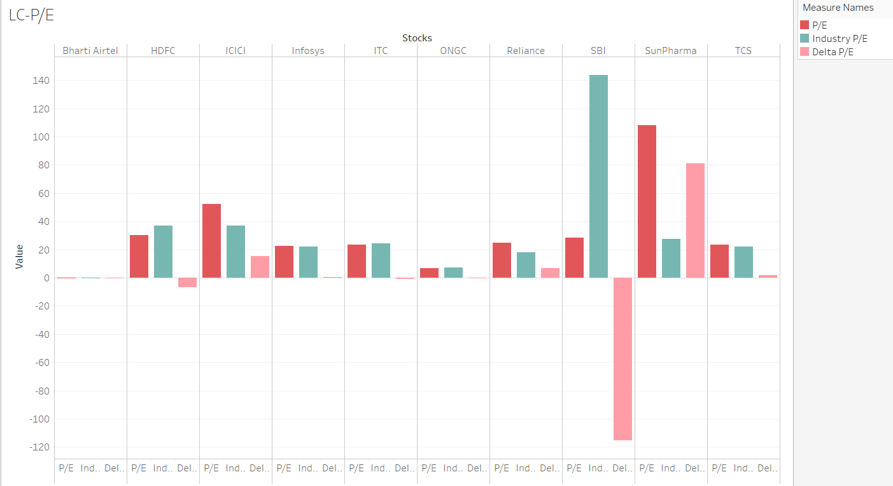

The motive behind the analysis was to find stocks with low P/E ratio as compared to the industry P/E ratio, that  is undervalued stocks. From the above graph it was observed SBI and HDFC had a low P/E ratio which seemed ideal for selection. But selection cannot be done a single parameter alone.
 

Mid cap
 
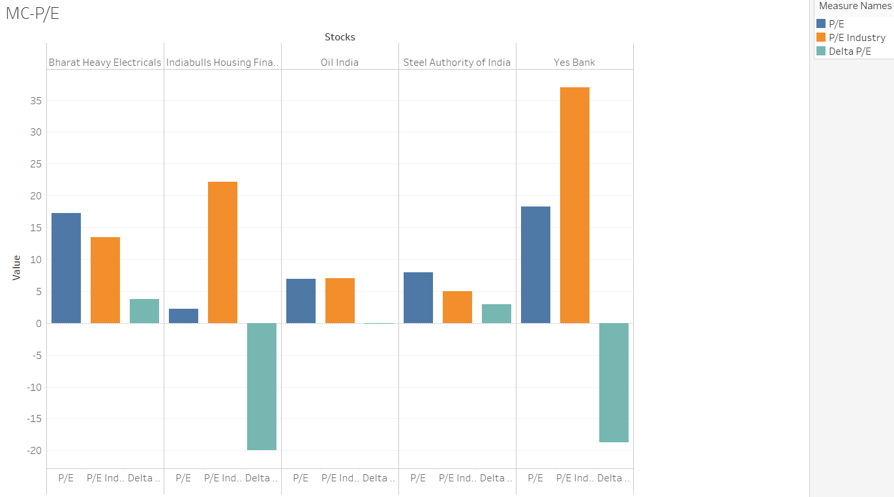  

Following the same analysis as above Indiabulls and Yes bank seems to be potential candidate.

**2.2.2 52 week low:**

The 52 week low and high usually acts as a support and resistance. There would have been some negative news about the stock which causes its price to fall and make a new low. Vice versa for it’s 52 week high which most probably could be due to some positive news

Large Cap 
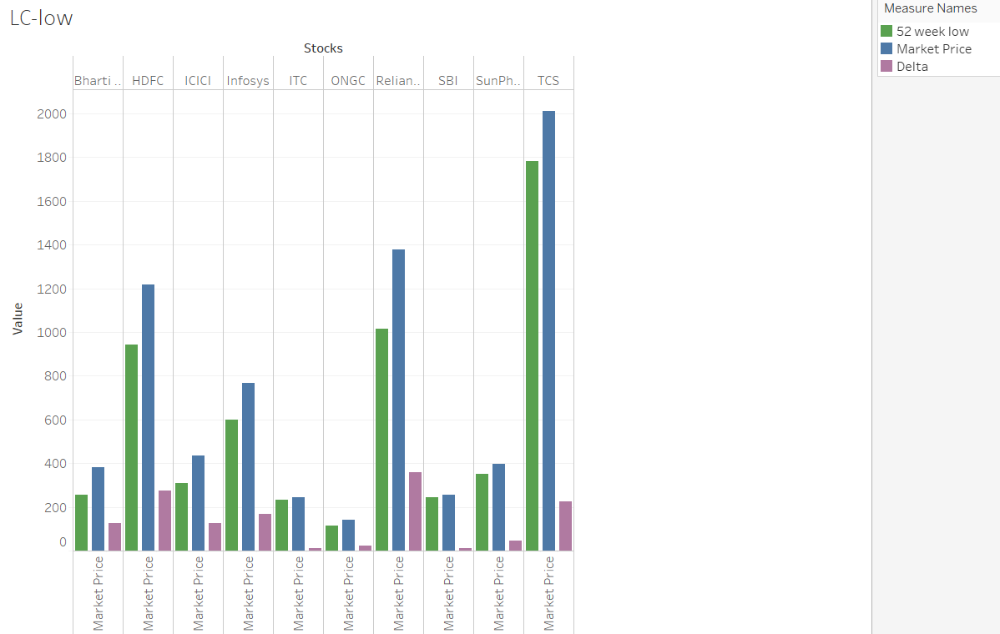

The objective was to find undervalued stocks which were near to 52 week low . Lower the delta the closer the value to its lowest. ITC,ONGC,SBI, SunPhrama are among the closest.

Mid Cap
 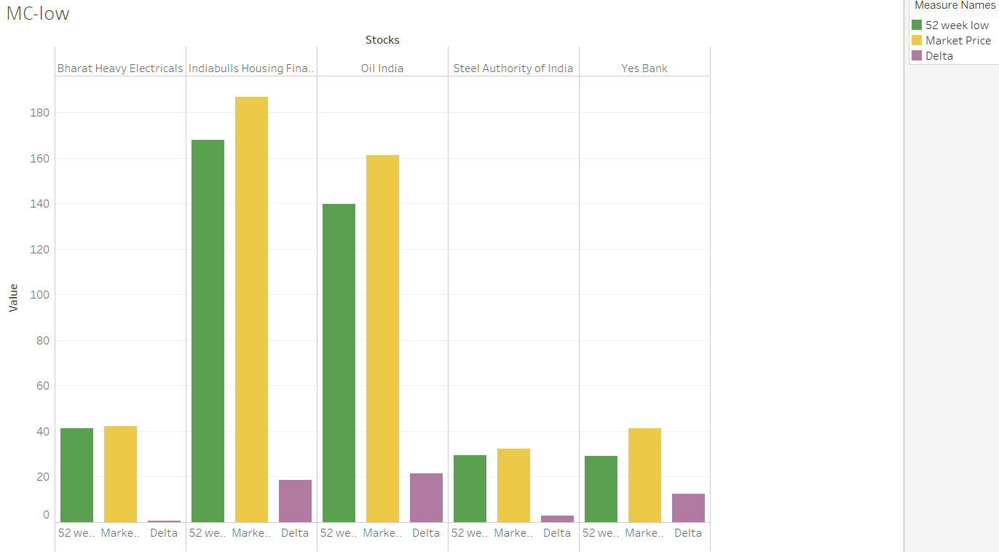

Bharat Heavy electricals and steel Authority of India had its current stock price close to its 52 week low.

**2.2.3 Interest Coverage Ratio:**

This is very important when it comes to stock picking. If ICR is strong, more often than not, the stock turns out to be really good. ICR usually means the companies ability to pay off it’s interest ( repayment of interest on loan taken) obligations. More the better. A company can fulfill it’s interest obligations provided it has good earnings before interest and taxes .
Sales - Cost = EBIT - Interest = EBT - Tax = PAT

where, EBIT is nothing but earnings before interest and taxes

EBT is earnings before tax after paying off the interest and

PAT is Profit after tax, profit after paying the interest and tax.

Higher the EBIT, higher will be the ICR. EBIT is also called as the operating profit, profit earned by the company from it’s business operations before interest and tax commitments.

Large Cap
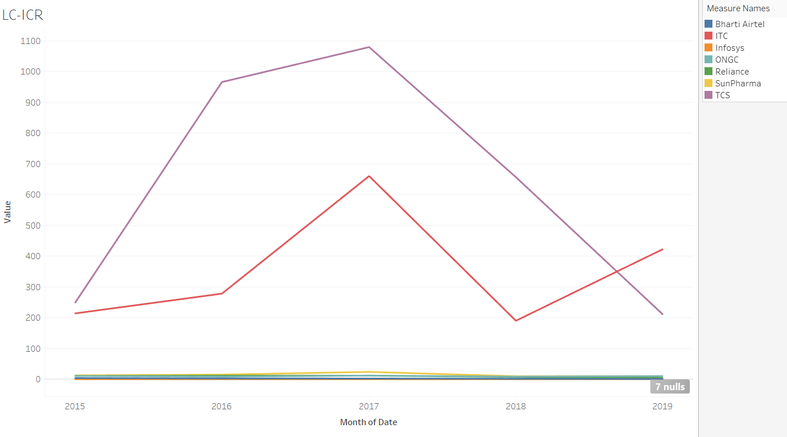
 

Instead of looking at single value a trend of 5 years was observed for consistent performance. TCS and ITC were among the top to consistently have a high ICR.

Mid Cap
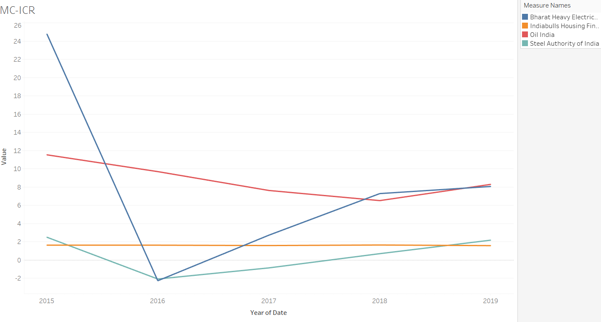
 

Although Bharat heavy had a drastic drop in 2016 it had upward trend after 2016.Oil India also had a consistent ICR throughout the period of 5 years

**2.2.4 ROE/ROCE:**

Return on equity means return earned by the company on the capital contributed by equity shareholders alone. Higher the better. This also gives an idea about how well is the money of equity shareholder is utilized by the company.

Return on capital employed means the return earned by the company on the capital contributed by both equity shareholder and debtholder ( Debentures, loans taken by the company etc ) It’s the total capital employed by the company in it’s business and not only equity capital as in the case of ROE. Both, higher the better

Large Cap
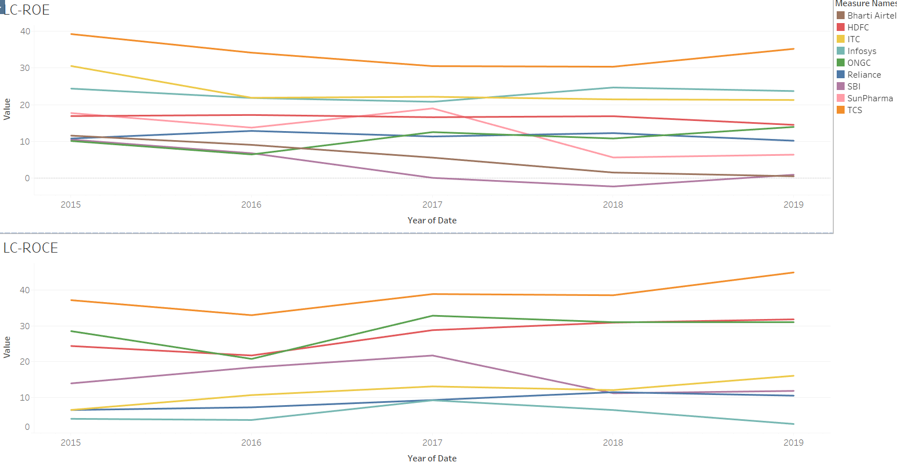
 

In both the categories TCS topped the chart, while the remaining stocks had different results in both the categories

Mid Cap
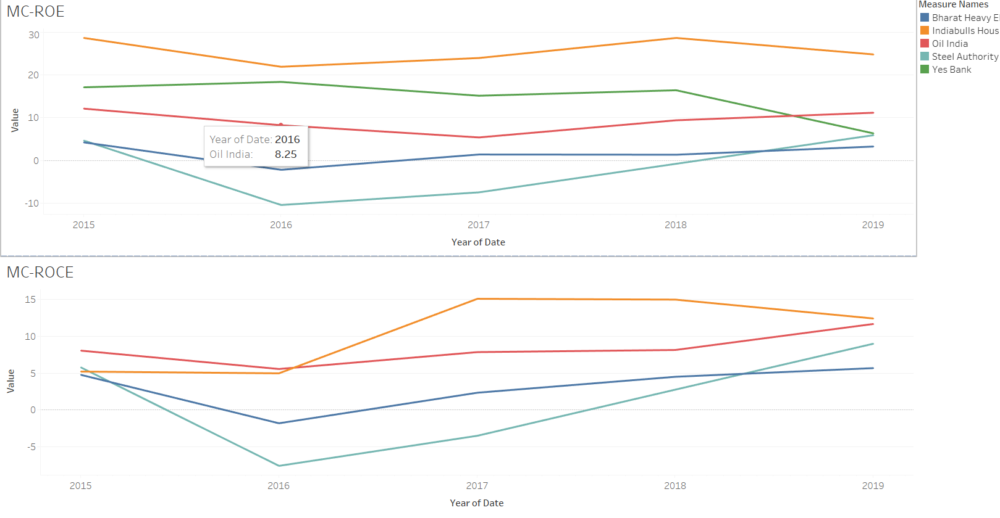
 

IndiaBulls topped the chart in Midcap, while Oil India had good ROCE and ROE as well.

**2.2.5  PBV ratio:**

Book value is nothing but the shareholders worth in the company. On the liability side of the balance sheet, you will see equity share capital and reserves. If you add up equity share capital and reserves, it is nothing but the shareholders worth in the company. So book value = shareholders money ( capital contributed by them + money transferred to reserves out of profits )

So price to book value usually means the price an investor has to pay for 1 rupee worth in the company

It is similar to PE where PE is nothing but a price an investor has to pay for 1 rupee earning of the company

In PE, it’s the earning. In PBV, it’s the worth. Lower the better, just like the PE

Large Cap

 

PBV value of less than 3 is considered good. ONGC, SBI, Bharti Airtel, Reliance, ICICI all have PBV ratio less than 3 with ONGC being the lowest.

Mid Cap
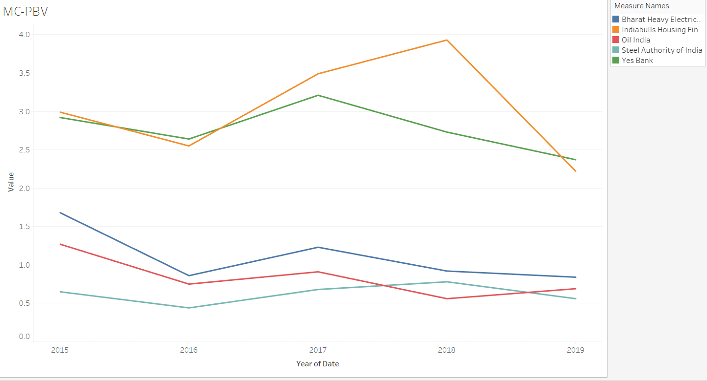
 

All the stocks had PBV value less than 3, but stocks such as Steel Authority of India, Oil India, Bharat Heavy electricals had the desirable PBV values.

**2.3 Result**

Based on the above analysis SBI ,ITC, ONGC, Sunpharma were selected from the large cap and 
IndiaBulls Housing Finance Ltd was selected from mid cap.

**2.4 Conclusion**

TCS was also a good candidate but a higher priority was given to PE ratio and 52 week low since the goal of the project was to maximize the return in one year using the long strategy.

**Chapter 3**

Deep Q-learning Vs Policy Gradient

**3.1 Scope**

There are many algorithms in reinforcement learning among which the popular ones most suitable for finance are Deep Q-learning and Policy Gradient. In this section both the algorithms were tested on random stock Karnataka bank and compared for better returns in a span of 200 days.

**3.2 Methodology**

This problem statement is to compare the two models without any hyperparameter tuning and evaluation to see which gave better results.

**3.2.1 Deep Q-learning**

Q-learning is an off policy reinforcement learning algorithm that seeks to find the best action to take given the current state. It’s considered off-policy because the q-learning function learns from actions that are outside the current policy, like taking random actions, and therefore a policy isn’t needed. More specifically, q-learning seeks to learn a policy that maximizes the total reward 
 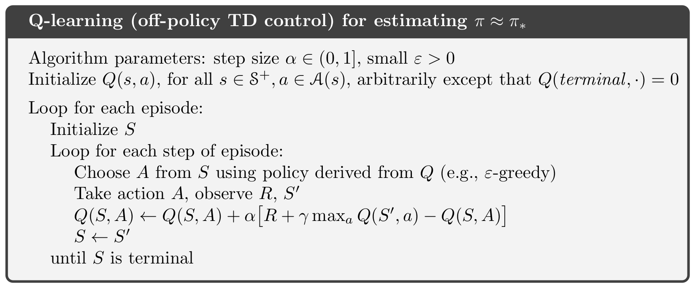

The process of Q-Learning creates an exact matrix for the working agent which it can “refer to” to maximize its reward in the long run. Although this approach is not wrong in itself, this is only practical for very small environments and quickly loses it’s feasibility when the number of states and actions in the environment increases.
The solution for the above problem comes from the realization that the values in the matrix only have relative importance ie the values only have importance with respect to the other values. Thus, this thinking leads us to Deep Q-Learning which uses a deep neural network to approximate the values. This approximation of values does not hurt as long as the relative importance is preserved.
The basic working step for Deep Q-Learning is that the initial state is fed into the neural network and it returns the Q-value of all possible actions as on output.

The model was tested on Karnataka bank csv data and predicted for next 200 days.
Initial Money given to the DQL agent was 10k and the model was trained for a period of 2 years of past data.

 

**3.2.2 Policy Gradient:**

Policy gradient methods are a type of reinforcement learning techniques that rely upon optimizing parametrized policies with respect to the expected return (long-term cumulative reward) by gradient descent. They do not suffer from many of the problems that have been marring traditional reinforcement learning approaches such as the lack of guarantees of a value function, the intractability problem resulting from uncertain state information and the complexity arising from continuous states & actions.

Finite-difference Methods
Finite-difference methods are among the oldest policy gradient approaches; they originated from the stochastic simulation community and are quite straightforward to understand. The policy parameterization is varied I times by small increments Δθi,i=1…I and for each policy parameter variation θh+Δθi roll-outs (or trajectories) are performed which generate estimates ΔJ^i≈J(θh+Δθi)−Jref of the expected return. There are different ways of choosing the reference value Jref , e.g. forward-difference estimators with Jref=J(θh) and central-difference estimators with Jref=J(θh−Δθi) . The policy gradient estimate gFD≈∇θJ|θ=θh can be estimated by regression yielding

gFD=(ΔΘTΔΘ)−1ΔΘTΔJ^,

where ΔΘ=[Δθ1,…,ΔθI]T and ΔJ^=[ΔJ^1,…,ΔJ^I]T denote the I samples. This approach can be highly efficient in simulation optimization of deterministic systems (Spall, 2003) or when a common history of random numbers (Glynn, 1987) is being used (the latter is known as PEGASUS in reinforcement learning (Ng & Jordan, 2000)), and the error of the gradient estimate can get close to O(I−1/2) (Glynn, 1987). However, the uncertainty of real systems will result in stochasticity and an artificial common history of random numbers can no longer be applied. Hence, when used on a real system, the performance degrades in a gradient estimate error ranging between O(I−1/4) to O(I−2/5) depending on the chosen reference value (Glynn, 1987). An implementation of this algorithm is shown below.

input: policy parameterization θh
for i=1 to  I do 
    generate policy variation Δθi
    estimate J^i≈J(θh+Δθi)=⟨∑Hk=0akrk⟩ from roll-out
    estimate J^ref , e.g., J^ref=J(θh−Δθi) from roll-out
    compute ΔJ^i≈J(θh+Δθi)−Jref
end for 
return gradient estimate gFD=(ΔΘTΔΘ)−1ΔΘTΔJ^

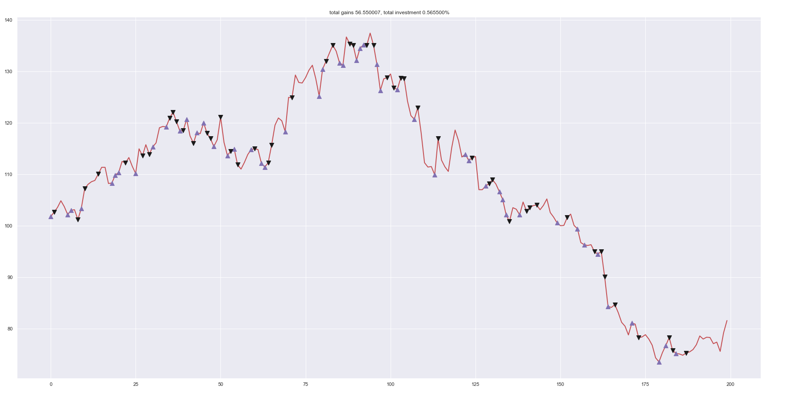
 

We see that the investment is positive 0.56% more than the initial money given to the agent after 200 days. The model performed well.

**3.3 Data and Variable**

Karnataka bank csv data was used. Both models were trained on data from 2017-2018 and predicted for 200 days in 2019.The only variable used was close price which was transformed by differencing.

**3.4 Results**

Initial Investment : 		10000
Test data: 			200 days
DQL Prediction Returns:  	-139.2999
PG Prediction Returns:  	56.55

**3.5 Conclusion**

The PG model is clearly outperforming the DQ model although its performance could be improved with hyperparameter tunning but due to time constraint the baseline models were considered.

**Chapter 4**

Policy Gradient implementation and Evaluation

**4.1 Scope**

In this section we explore the optimum model conditions to maximize the returns.

**4.2 Methodology**

The model was trained on SBI stock which was selected at random and fine tuned. The model was tested for different settings in order to find out the optimum performance.

•	Number of epochs : 50, 100, 150
•	Weights Initialization: Normal Initialization, Xavier Initialization
•	Train data: 1year, 2years, 3 years, 4 years.
•	Variables: Close, High, Low, Open.
The following were the result experiments:

•	Normal Initialization for 50 epochs
 

•	Normal Initialization for 100 epochs
 

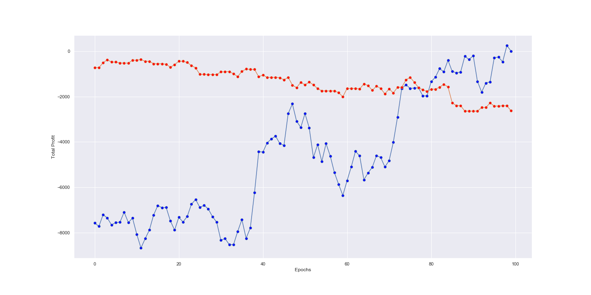

•	Normal Initialization for 150 epochs
 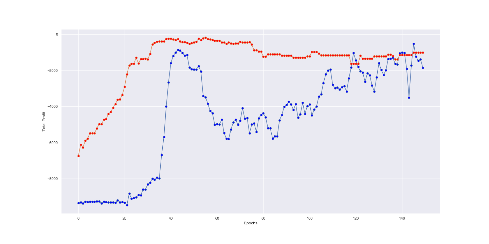

•	Xavier initialization for 50 epochs
 

•	Xavier initialization for 100 epochs

 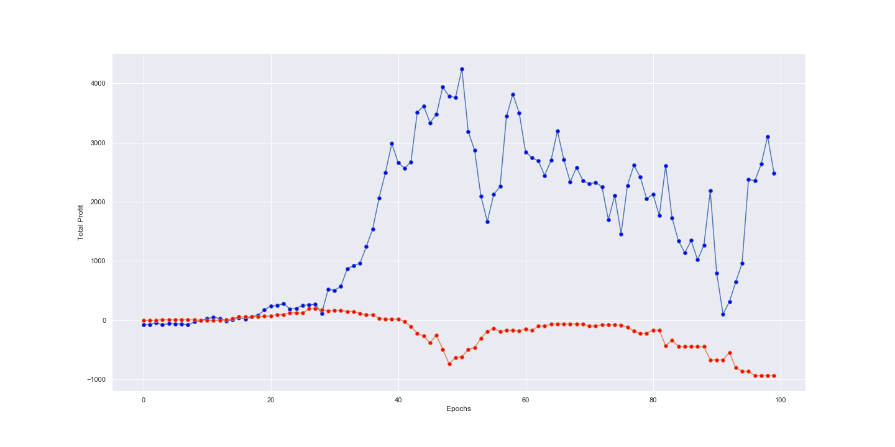

•	Xavier initialization for 150 epochs
 

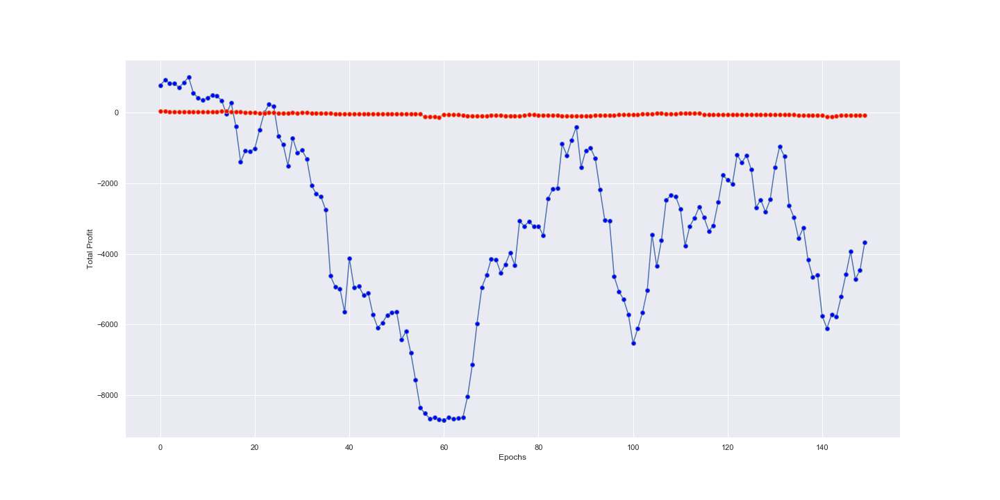

•	Here the model was tested for different training data size 
 
Since 4 years data was too much and didn’t perform well on the other stocks past 2 years data was selected for training.

•	Next the model was trained for different input variables. 
 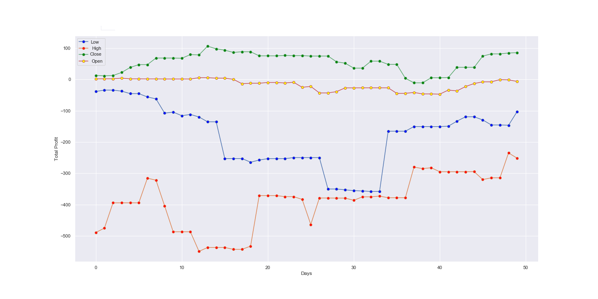
Close variable was selected since it gave consistent returns.

**4.3 Result**

Final Model settings :
•	Number of epochs : 50
•	Weight Initialization : Normal Initialization
•	Training data : 2 years
•	Test data : 252 days
•	Variable : Close Price

**Chapter 5**

Multi Agent Policy Gradient

**5.1 Scope**

Since the final model was selected now it was time to implement the final model on all the 5 stocks

**5.2 Methodology**

Finally the model was implemented on the following stocks and the returns for a year  was computed.

•	State Bank of India Ltd

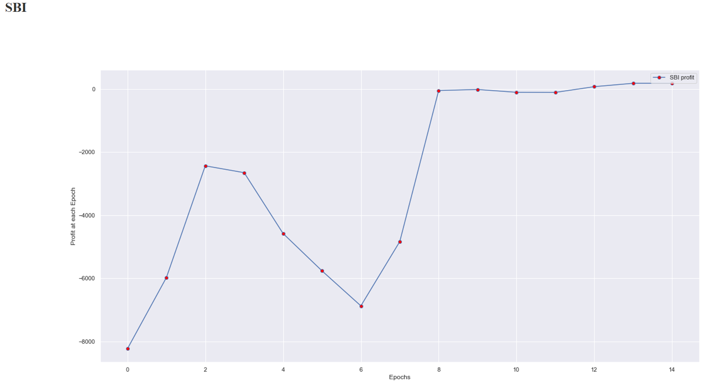
 

In the above graph x axis denotes number of epochs and y axis the returns. For SBI the model was trained for 15 epochs. RL models are very sensitive to overfitting hence a threshold was set to around positive150 returns. 

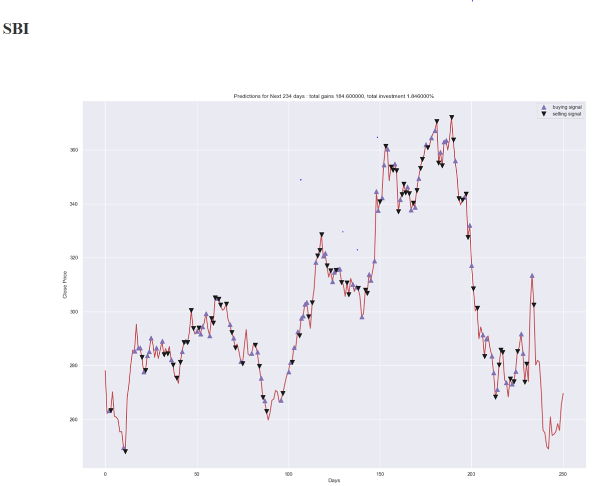

 

Predictions for 234 days 
total gains 184
Total investment 1.846 %

•	ITC

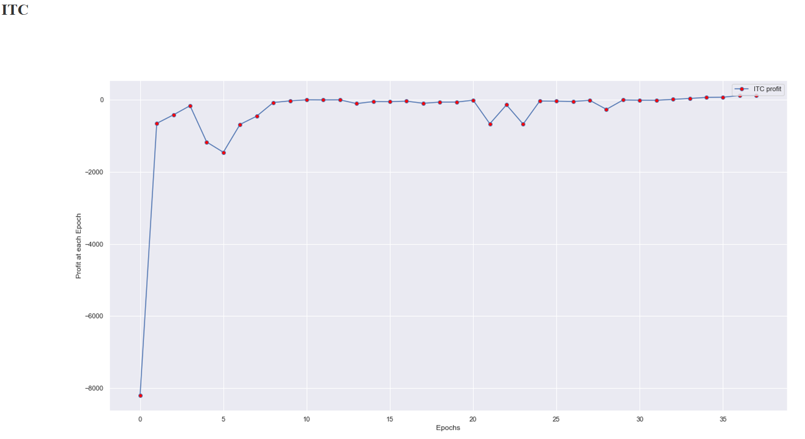
 

ITC was trained for 37 epochs, after 35th epoch it gave positive returns

 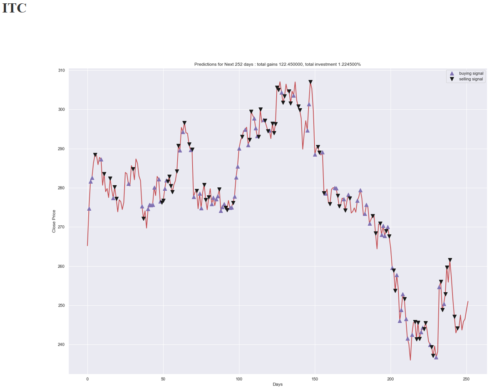

Predictions for 252 days 
total gains 122.45
Total investment 1.224 %

•	Oil and natural Gas Corporation

 

ONGC was trained for 28 epochs after which it started giving positive returns

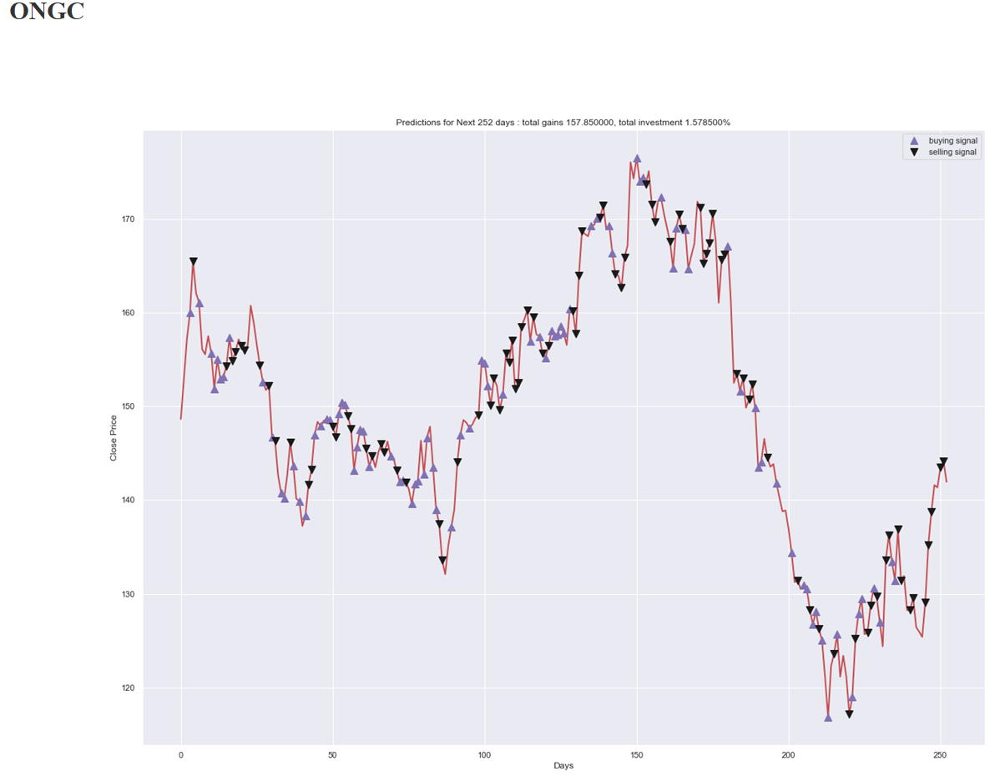

 

Predictions for 252 days 
total gains 157.85
Total investment 1.5785 %

•	IndiaBulls Housing Finance Ltd

 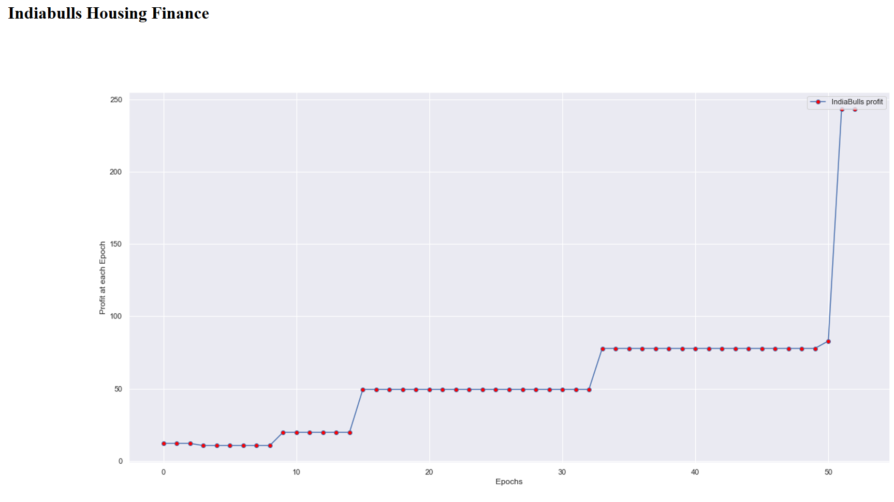

IndiaBulls was trained for 52 epochs. Although model conditions were optimum for 50 epochs it also depends on data.If the data is not good the model will not perform well (garbage in garbage out) 
 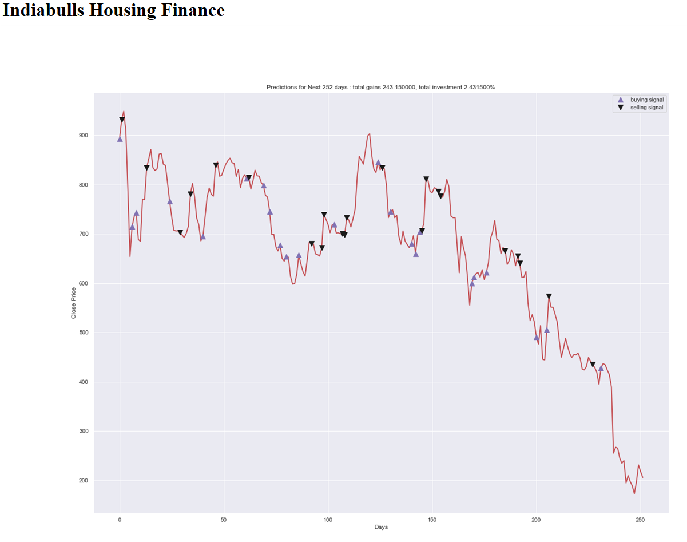

Predictions for 252 days 
total gains 243.15
Total investment 2.4315 % 

•	Sun Pharma Ltd

 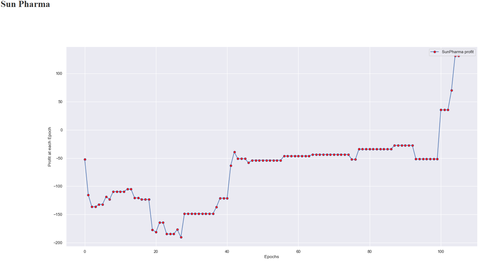

Sun Pharma was trained for 103 epochs giving positive returns at the end

 
Predictions for 252 days 
total gains 131.45
Total investment 131.45%

**5.3	Results**

For every stock there is one agent so we have 5 agents i.e 5 models. Every agent was given 10k initial, so total of 50k was invested. Below is the overall assessment of multiagent system.

 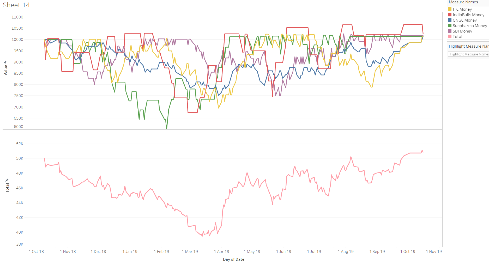

In the above Picture there are two graphs the above graph is the cash at hand at given point in time of individual agent.The below graph is the total cash at hand out of 50k at given point. The graph below shows a  downward trend initially which reaches its lowest around March-April, this indicates two possibilities that either the agent is investing a lot of money buying stocks and holding them or the agent is losing money by  making bad decisions. But eventually post April sees an upward trend and closing at 51,123 making a profit of 1123 .

**5.4	Conclusion**

Given the restriction on agents to trade just single unit at a time the profit earned was commendable. There is a lot of scope for improvement with this model and in future its potential can be explored for better returns. RL algorithms are in its early stage of development as compared to ML and DL so these models will keep improving until it outperforms the other models.

**References**

[1] Sutton and Barto : Reinforcement learning: An Introduction.

[2] Sudharsan Ravichandiran: Reinforcement learning with  python.

[3]John Moody and Matthew Saffel, “Reinforcement learning for trading”,White paper.
